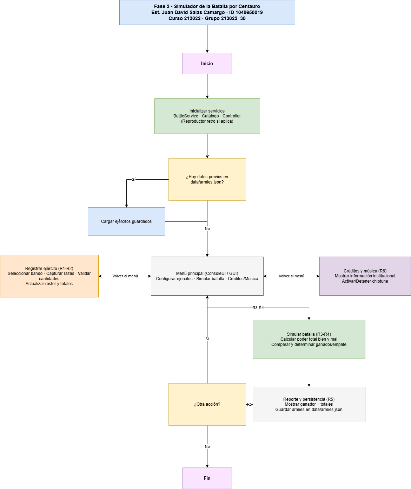

# Fase 2 - Simulador de la Batalla por Centauro

## Portada

| Elemento | Detalle |
|----------|---------|
| Universidad | Universidad Nacional Abierta y a Distancia - UNAD |
| Escuela | ECBTI - Escuela de Ciencias Basicas, Tecnologia e Ingenieria |
| Curso | Fundamentos de Programacion (codigo 213022) |
| Fase | Fase 2 - Variables, constantes y estructuras de control |
| Estudiante | Juan David Salas Camargo |
| Identificacion | 1049650019 |
| Grupo | 213022_30 |
| Programa academico | Ingenieria de sistemas |
| Fecha de entrega | 03-11-2025 |

## Situacion problema seleccionada

| Estudiante | Problema asignado |
|------------|------------------|
| Juan David Salas Camargo | Problema 3 - Simulacion de la batalla en el planeta Centauro |

**Descripcion breve del problema:** \
El planeta Centauro se encuentra en guerra. Los ejercitos del bien y del mal estan conformados por razas con valores comprendidos entre 1 y 5. Se requiere un programa que permita configurar la cantidad de integrantes por raza, calcule la fuerza total de cada ejercito y determine si el bien gana, el mal gana o se produce un empate. Los ejemplos proporcionados en la guia (1 Osito pierde contra 1 Hoggin, 2 Ositos empatan contra 1 Hoggin, 3 Ositos ganan a 1 Hoggin) sirven como casos de referencia para validar la solucion.

### 3.1 Razas y valores utilizados

| Bando benevolo | Valor | Bando malvado | Valor |
|----------------|-------|---------------|-------|
| Ositos | 1 | Lolos | 2 |
| Principes | 2 | Fulanos | 2 |
| Enanos | 3 | Hoggins | 2 |
| Caris | 4 | Lurcos | 3 |
| Fulos | 5 | Trollis | 5 |

---

## Tabla 2. Requerimientos funcionales

| ID | Descripcion | Entradas | Resultados (salidas) |
|----|-------------|----------|----------------------|
| R1 | Registrar la cantidad de unidades para cada raza benevola. | Nombre de la raza benevola, numero de unidades. | Roster almacenado para el ejercito del bien. |
| R2 | Registrar la cantidad de unidades para cada raza malvada. | Nombre de la raza malvada, numero de unidades. | Roster almacenado para el ejercito del mal. |
| R3 | Calcular el poder total de cada ejercito sumando valor de raza por cantidad. | Roster del bien y del mal. | Totales de unidades y poder acumulado. |
| R4 | Determinar el resultado de la batalla comparando los poderes. | Poder total del bien y del mal. | Resultado textual: gana el bien, gana el mal o empate. |
| R5 | Presentar el resultado y permitir gestionar la simulacion desde consola o GUI. | Acciones del usuario (menu, botones). | Reportes en consola, ventanas GUI y persistencia en `data/armies.json`. |
| R6 | Ofrecer creditos del proyecto y ambientacion musical opcional. | Solicitud del usuario (menu o boton). | Ventana emergente o listado en consola con creditos; musica 8 bits generada procedimentalmente. |

---

## Analisis y diseño

- **Paradigma empleado:** programacion estructurada con separacion por capas (controladores, servicios, infraestructura y UI).
- **Modelo de datos:** razas parametrizadas con valor base; ejercitos almacenan pares (raza, cantidad). El archivo `data/armies.json` conserva la configuracion entre sesiones.
- **Persistencia:** clase `JsonArmyStorage` en `app/infrastructure/persistence.py`.
- **Logica de batalla:** servicio `BattleService` calcula los poderes y define el resultado (`BattleOutcome`). Los ejemplos solicitados en la guia se reflejan automaticamente por el calculo de fuerza.
- **Interfaz de usuario:** `ConsoleUI` y `GameWindow` comparten el mismo `GameController`. Se anadio un boton/menu para creditos y la musica procedimental se activa por defecto en la GUI.
- **Musica procedimental:** `ProceduralChiptune` genera temas inspirados en RPG clasicos utilizando progresiones armonicas, escalas pentatonicas y proporciones aureas.
- **Diagrama de flujo:** pendiente por documentar (se entregara en formato draw.io conforme a la guia).
a

---

## Implementacion

- **Archivo principal:** `main.py` - soporta modos consola, GUI o menu interactivo, y la bandera `--no-music`.
- **Controlador:** `app/controllers/game_controller.py` - coordina servicios, persistencia, creditos y musica.
- **Servicio de batalla:** `app/services/battle_service.py` - aplica la logica de comparacion de fuerzas.
- **Interfaces:** `app/ui/console.py` (menu textual) y `app/ui/gui.py` (Tkinter); ambos acceden al mismo controlador.
- **Musica:** `app/infrastructure/music.py` - generador 8 bits y reproductor pygame.
- **Pruebas automatizadas:** `python -m unittest` (ver carpeta `tests/`).
- **Pasos sugeridos de ejecucion:**
  1. Crear (opcional) un entorno virtual con `python -m venv .venv` y activarlo.
  2. Instalar dependencias opcionales con `pip install pygame`.
  3. Ejecutar `python main.py --mode console` o `python main.py --mode gui` segun la interfaz deseada.
  4. Usar el menu/boton de creditos para verificar la informacion institucional.

Para un respaldo completo, se anexan todos los archivos del proyecto en la carpeta entregable (`Grupo_Fase2_NombreApellido.zip`). El listado anterior indica los modulos clave para revisar la logica solicitada.

---
## Diagrama de flujo

---
---

## Pruebas realizadas

| Caso evaluado | Configuracion (Bien vs Mal) | Resultado esperado | Resultado obtenido |
|---------------|-----------------------------|--------------------|--------------------|
| Caso guia 1 | 1 Osito vs 1 Hoggin | Gana el mal | Gana el mal |
| Caso guia 2 | 2 Ositos vs 1 Hoggin | Empate | Empate |
| Caso guia 3 | 3 Ositos vs 1 Hoggin | Gana el bien | Gana el bien |
| Prueba automatizada | `python -m unittest` | Todas las pruebas pasan | OK |

Las pruebas manuales se realizaron ingresando los valores en la interfaz de consola. Las automatizadas validan persistencia, calculo de poderes y control de musica mediante `tests/test_game_controller.py`.

---

## Conclusiones

1. La simulacion demuestra que las variables, estructuras de control y colecciones permiten modelar escenarios complejos a partir de reglas sencillas.
2. La separacion en capas facilita reutilizar la logica en varias interfaces (consola y GUI) y permite anadir valor agregado (musica y creditos) sin modificar el nucleo del problema.

---

## Referencias bibliograficas

1. Python Software Foundation. *Python 3.12 Documentation*. Disponible en: https://docs.python.org/3/
2. Pygame Community. *Pygame Documentation*. Disponible en: https://www.pygame.org/docs/
3. Universidad Nacional Abierta y a Distancia (UNAD). *Guia de aprendizaje - Fase 2. Variables, constantes y estructuras de control*. 2025.
